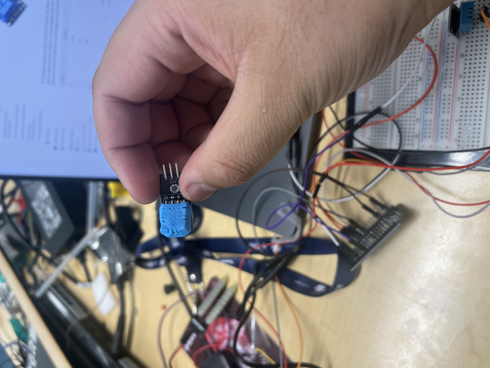

# 🌱 Ploonty – The Smart Plant That Doesn’t Just Alert—It Acts

> _“We didn’t forget the plant. We just weren’t there when it needed us.”_

---

## 💡 Inspiration

It started with a plant we forgot to water — even though the watering can was right there.

It wasn’t a failure of care. It was a failure of **presence**.

So we built Ploonty — a system that doesn't just detect dryness, but **acts** on it. It’s not just smart. It’s **empathetic**.

---

## 🌿 What It Does

Ploonty is an autonomous plant health system that senses and responds:

- 🌡️ Monitors **soil moisture**, **temperature**, and **humidity**
- 🚰 Activates a **relay-controlled pump** pulling from a **rainwater reservoir**
- 📺 Displays the plant’s mood using a minimalist **OLED screen**
- 🧠 Applies smart logic to avoid overwatering
- 🧘‍♂️ Designed to work **without notifications or manual input**

---

## 🛠 How We Built It

### Hardware
- **ESP32**: main controller
- **DHT11 Sensor**: temperature & humidity
- **Soil Moisture Sensor**
- **Relay Module** + **Pump**
- **Rainwater Reservoir**
- **OLED Display**
- **PKMUR160 Diode** for motor protection

### Software
- Written in **Arduino/C++**
- **Debounced logic** for clean sensor events
- Smart thresholds for watering intervals
- OLED “emoji face” system for plant feedback 🙂

---

## 💧 The Pump That Changed Everything

We built the pump system ourselves.

From scratch.  
From burnt wires to a working flow.  
From silence to life-giving motion.

Once the sensors and pump began talking...  
It wasn’t just a project anymore.  
It was care. It was presence.

---

## 🔥 Challenges

- 🔁 Relay misfires & motor glitches
- 💦 Designing a rainwater-safe system
- 🔥 Fried sensors (RIP DHT11)
- 🤯 Logic bugs that made the plant smile… while dying

---

## ✅ Accomplishments

- Fully **autonomous watering system**
- Built from **raw components**
- Sustainable & off-grid friendly
- Designed with **compassion in mind**, not just code

> “We didn’t finish a project — we gave something the ability to care.”

---

## 📚 What We Learned

- Hardware is... humbling
- A diode is not optional. Ever.
- Debugging `NaN` humidity at 2am builds character
- The most powerful tech solves *small*, *real* problems

---

## 🚀 What’s Next

- 📊 Firebase/Blynk **dashboard monitoring**
- 🌐 Mesh networking between plants
- ☀️ Solar integration for total autonomy
- 🪴 Multi-plant syncing for smart gardens
- 📱 A companion app that says:  
  _“Hey, I just drank a little. Feeling better now.”_

---

## 🤍 Final Thought

This wasn’t about automation.  
It was about **presence**.  
It was about building something that listens when we can’t be there.

A plant can’t speak.  
But it still needs care.

Ploonty doesn’t just listen.  
It acts.

> _This isn’t just smart home tech._  
> _It’s compassion, embedded in code._  
> **Ploonty. Peace of mind, with roots.**

---

## 🧠 Authors & Contributors

- Amal Alhaj
- Shrish
- Swapnil Deb
- Yasmeen Shalabi

---

## 🪴 License

MIT License – Feel free to fork, grow, and share.

---

## 🙏 Support

If this project helped or inspired you, consider watering your own plant. Or someone else’s. 🌧️
